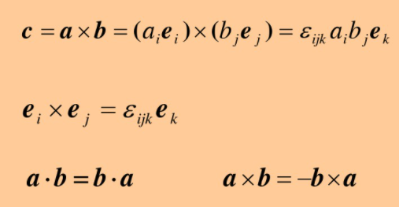
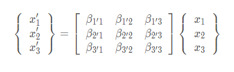
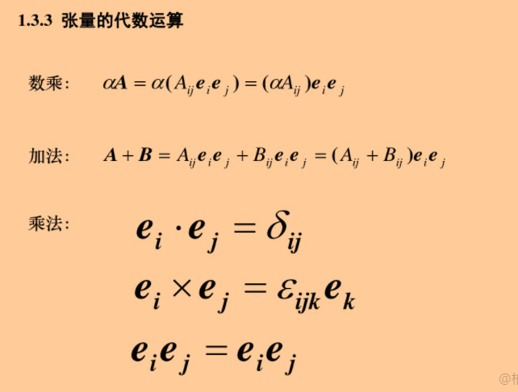
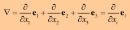
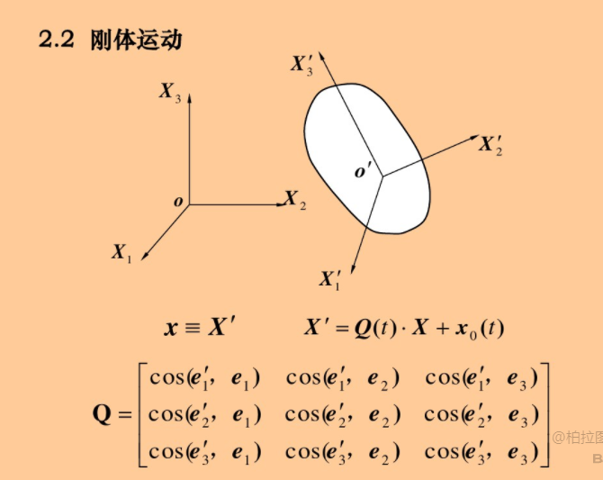
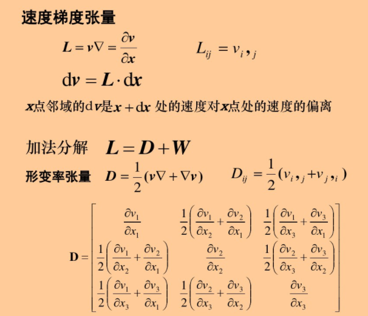

https://wenku.baidu.com/view/7fb07c396e175f0e7cd184254b35eefdc8d31537

https://www.bilibili.com/video/BV177411u7iK?p=3&spm_id_from=pageDriver

## 问题:平衡方程和动力学方程关系

# 矢量、矩阵与张量

#### 矢量

#### 常见点乘

ei\dot ej等于 引入Kronecker记号

#### 点乘

对于三维空间，i∈（1-3），j∈(1-3)

#### 自由指表

此处j是哑表从而

在三维空间中等于=
$$
\delta_{ij}a_{j}在三维空间中哑表表示为\delta_{i1}a_{1},\delta_{i2}a_{2},\delta_{i3}a_{3},
$$

$$
当i分别等于1，2，3时才有\delta才不为零，从而有\delta_{11}a_{1},\delta_{22}a_{2},\delta_{33}a_{3}，因此经过哑表简化j=i时才有意义
$$

#### 失积（叉乘）

本有27项，但当下表都不重复时存在意义，共有6项

**当两个基矢量eiej这样直接放在以前和点乘不是一个概念，叫做并基，是在张量处使用，但具体空间概念不明**

## 场论概要

## 

$$
g=▽\varphi=\varphi,_{i}e_{i}=\varphi,_{1}e_{1}+\varphi,_{2}e_{2}+\varphi,_{2}e_{2}
=\frac{\partial \varphi}{\partial x_{1}}e_{1}+\frac{\partial \varphi}{\partial x_{2}}e_{2}+\frac{\partial \varphi}{\partial x_{2}}e_{2}
$$

某一方向上的导数为x,y,z轴导数乘以方向角

### 散度

一个有方向性的量穿过某个面的量，叫通量，**所以必须是矢量场**

一个矢量在一个法线方向的通量等于一个面积分。

实质：一个封闭曲面的面积分可以变成针对他的体积分

体积分的概念是在一个空间中一个微元体的物理量，然后对于整个空间的微元体相加

**也就是说，例如速度矢量场(u,v,w)，其中u,v,w每一个都是一个关于坐标轴(x,y,z)的函数**

**也就是(u(x,y,z),v(x,y,z),w(x,y,z))**

https://blog.csdn.net/qq_43170213/article/details/90477789

散度物理意义为：

源和汇：一个房间把他封闭，理论上房间中不应该有风，但若有个外界交互的通道，可以通过测量，房间中每一点的速度的速度场，求他的每一点的散度，就知道，通道在哪

散度可以查找某一空间中的物理量是否有丢失的地方或是否有产生的地方

### 旋度

旋度也与空间中矢量有关

梯度是哈密顿算符和矢量的并集

## 张量

标量-数量    矢量-数量+方向  张量-矢量+“方向”

#### ！！！额外张量信息：

https://zhuanlan.zhihu.com/p/121429834

https://blog.csdn.net/qq_45777142/article/details/107149606

张量与所在坐标系无关

拥有方向的数目决定张量的阶数。

**众所周知，物理量在不同坐标系下（不同的基低）的分量（基矢量）是不同的，而张量给出了物理量各分量在坐标变换时的变换规律。这意味着无论坐标系怎么改变，我们都能正确地描述该物理量，这就是引入张量的必要性**

**张量主要是在不同坐标系下可以表示一个相同的量**

张量不会因为人为旋转不同的参考系而改变，但张量的分量的值与坐标系密切相关。

**在数值上，最简单张量，其实就是矢量做导数运算的到，**

**但因为矢量的每一项都是多个维度的相关关系，例如速度，在三维空间中u,v,w都是三个坐标轴x,y,z的函数，从而u,v,w三个都可以除以x,y,z，产生9项，并且除的过程中，e(1-3)也进行融合，放在一起，由两个e，例如eiej那么就是二阶矢量。**

数序形式上，每一项，存在两个坐标系相乘ei,ej或ei,ei或ej,ei

确实是，速度的每一个量都是x1,x2的函数，同理如果速度为(u,v,w)那么u,v,w都为x,y,z的函数

#### 张量定义：

**在不同的坐标系下，不同的基矢量乘以系数得到的一个量相同，那么这个量就是二阶张量**

https://blog.csdn.net/qq_45777142/article/details/107149606

#### 张量定义参考：

**张量主要是在不同坐标系下可以表示一个相同的量**

在笛卡尔坐标系下存在一个矢量
$$
r(x_{1},x_{2},x_{3})=x_{1}e_{1}+x_{2}e_{2}+x_{3}e_{3}
$$

(1)单位向量：

对坐标的偏导数定义的三个基矢量gi:
$$
g_{i}=\frac{\partial r}{\partial x_{i}} (i=1,2,3)=e_{i}
$$
(2)系数：

系数x1,x2,x3

欧式空间中的一般坐标系有几个特性：

- 现在的坐标线可能**不再正交**。
- 不同点处的坐标线**可能不再平行**。
- 基矢量的**大小和方向都可能随点而异**。
- 各点处的参考架**不再是正交标准化基**。

当存在新的正交基

与原本正交基相同，新的基也满足
$$
e_{i}^{'}\cdot e_{j}^{'}=\delta_{ij} ; e_{i}\cdot e_{j}=\delta_{ij}
$$
引入转换系数讲老基分解为新的基底
$$
e_{i}^{'}=\beta_{i1}e_{1}+\beta_{i2}e_{2}+\beta_{i3}e_{3}=\sum \beta_{ij}e_{j}\\

\begin{bmatrix}
e_{1}^{'} \\
e_{2}^{'}\\
e_{3}^{'}
\end{bmatrix}=
\begin{bmatrix}
\beta_{11} & \beta_{12} & \beta_{13} \\
\beta_{21} & \beta_{22} & \beta_{23} \\
\beta_{31} & \beta_{32} & \beta_{33}
\end{bmatrix}\begin{bmatrix}
e_{1} \\
e_{2}\\
e_{3}
\end{bmatrix}
$$
从而转换系数应该为
$$
\beta_{ij}=cos(e_{i}^{'},e_{j})=e_{i}^{'}\cdot e_{j}=e_{j}\cdot e_{i}^{'}\\
\begin{bmatrix}
\beta_{11} & \beta_{12} & \beta_{13} \\
\beta_{21} & \beta_{22} & \beta_{23} \\
\beta_{31} & \beta_{32} & \beta_{33}
\end{bmatrix}=
\begin{bmatrix}
e_{1}^{'}\cdot e_{1} & e_{1}^{'}\cdot e_{2} & e_{1}^{'}\cdot e_{3} \\
e_{2}^{'}\cdot e_{1} & e_{2}^{'}\cdot e_{2} & e_{2}^{'}\cdot e_{3} \\
e_{3}^{'}\cdot e_{1} & e_{3}^{'}\cdot e_{2} & e_{3}^{'}\cdot e_{3}
\end{bmatrix}
$$
那么以新基的基地分解为老基底
$$
e_{j}=\beta_{1^{'}j}e_{1}^{'}+\beta_{2^{'}j}e_{2}^{'}+\beta_{3^{'}j}e_{3}^{'}=\sum \beta_{i^{'}j}e_{i}^{'}\\
\begin{bmatrix}
e_{1} \\
e_{2}\\
e_{3}
\end{bmatrix}=
\begin{bmatrix}
\beta_{1^{'}1} & \beta_{2^{'}1} & \beta_{3^{'}1} \\
\beta_{1^{'}2} & \beta_{2^{'}2} & \beta_{3^{'}2} \\
\beta_{1^{'}3} & \beta_{2^{'}3} & \beta_{3^{'}3}
\end{bmatrix}\begin{bmatrix}
e_{1}^{'} \\
e_{2}^{'}\\
e_{3}^{'}
\end{bmatrix}=\\
\begin{bmatrix}
e_{1}^{'}\cdot e_{1} & e_{2}^{'}\cdot e_{1} & e_{3}^{'}\cdot e_{1} \\
e_{1}^{'}\cdot e_{2} & e_{2}^{'}\cdot e_{2} & e_{3}^{'}\cdot e_{2} \\
e_{1}^{'}\cdot e_{3} & e_{2}^{'}\cdot e_{3} & e_{3}^{'}\cdot e_{3}
\end{bmatrix}
$$
在场景中的三个向量可以用三角法则表示
$$
r^{'}=r_{0}^{'}+r
$$
**通过这三个不同的r，我们将新坐标系与原坐标系形成了一种联系，能够让我们实现其中矢量相互转换的联系：**
$$
r^{'}=x_{i}^{'}e_{i}^{'}, \qquad r=x_{j}e_{j},\qquad r_{0}^{'}=(x_{i}^{'})_{0}e_{i}^{'}
$$
要想实现坐标转变，需要将原坐标系中的目标矢量投影到新坐标中，需要使用
$$
e_{i}^{'}点乘r^{'}=r_{0}^{'}+r的左右两边
$$
从而左侧为：
$$
r^{'}\cdot e_{i}^{'}=x_{k}^{'}e_{k}^{'}\cdot e_{i}^{'}=x_{k}^{'} \delta_{ki}=x_{i}^{'}
$$
右侧为：
$$
(r+r_{0}^{'})\cdot e_{i}^{'}=x_{j}e_{j}\cdot e_{i}^{'} +(x_{k}^{'})_{0}e_{k}^{'}\cdot e_{i}^{'}=x_{j}\beta_{ij} +(x_{i}^{'})_{0}
$$
上述两个公式可以用可以将新坐标用老坐标表示（也就是一个矢量在新坐标系下的表示方法，可以由老坐标系表示）

同样，老坐标可用新坐标表示

根据爱因斯坦求和约定以及指标相关知识，我们可以将它展开成矩阵的形式（坐标原点未变）：
$$
\begin{bmatrix}
x_{1}^{'} \\
x_{2}^{'}\\
x_{3}^{'}
\end{bmatrix}=
\begin{bmatrix}
\beta_{1^{'}1} & \beta_{1^{'}2} & \beta_{1^{'}3} \\
\beta_{2^{'}1} & \beta_{2^{'}2} & \beta_{2^{'}3} \\
\beta_{3^{'}1} & \beta_{3^{'}2} & \beta_{3^{'}3}
\end{bmatrix}=
\begin{bmatrix}
x_{1} \\
x_{2}\\
x_{3}
\end{bmatrix}
或者：
\begin{bmatrix}
x^{'} \\
\end{bmatrix}=\begin{bmatrix}
\beta \\
\end{bmatrix}=\begin{bmatrix}
x \\
\end{bmatrix}\\
\begin{bmatrix}
x_{1} \\
x_{2}\\
x_{3}
\end{bmatrix}=
\begin{bmatrix}
\beta_{1^{'}1} & \beta_{2^{'}1} & \beta_{3^{'}1} \\
\beta_{1^{'}2} & \beta_{2^{'}2} & \beta_{3^{'}2} \\
\beta_{1^{'}3} & \beta_{2^{'}3} & \beta_{3^{'}3}
\end{bmatrix}=\begin{bmatrix}
x_{1}^{'} \\
x_{2}^{'}\\
x_{3}^{'}
\end{bmatrix}
或者简化为：
\begin{bmatrix}
x \\
\end{bmatrix}=\begin{bmatrix}
\beta \\
\end{bmatrix}^T=\begin{bmatrix}
x^{'}\\
\end{bmatrix}
$$

这就是一个两个坐标系的矩阵变化

##### 总结：

**张量都不会因人为选择参考系的改变而改变**，但是**张量分量的值则与坐标系的选择密切相关**（这两个都会改变）

也就是空间中一个不变的值，该值叫做张量（注意在空间中表示一个值需要通过坐标系定义），同时该值在不同的坐标系下理论上都可以表示，例如使用标准正交基的坐标系，可以表示该值，或者坐标系不再正交的一个坐标系也可以表示该值，但对于不同坐标系表示该值最终得到的这个值都相同。

另外例如前面所说的不同坐标系下的矢量，

这里同一个量在在新坐标系下表示为x'，但在应一个坐标系下表示为x1，这两个x不同，分别在不同坐标系下，但表示在空间中张量是一样。

----------------------------------------------------------------------------------------------------------------------------

**感觉并积有点类似与两个坐标轴相乘在一起？**

**<u>几阶张量与基的维度无关，三维空间依然存在二阶张量，张量的阶数只与每一项的e的个数有关，</u>**例如
$$
A=A_{ijk}e_{i}e_{j}e_{k}
$$
那么A就是三阶张量

#### 证明速度的梯度是二阶张量：

基坐标ei,j不影响运算

因此类似于标量梯度求解

$$
\bigtriangledown v=v_{j,i}e_{i}e_{j}\\
=\frac{\partial v_{1}}{ \partial x_{1}}e_{1}e_{1}+
\frac{\partial v_{1}}{ \partial x_{2}}e_{1}e_{2}+
\frac{\partial v_{2}}{ \partial x_{1}}e_{2}e_{1}+
\frac{\partial v_{2}}{ \partial x_{2}}e_{2}e_{2}
$$
这只是2维项，v1可以一直到n，x1也是1-n,那也是二阶张量

**任意一个物理量，主要在自然界客观存在，那么一定是张量。**

#### 问题：速度的散度和速度的梯度(未解决)

上方的散度难道是？
$$
div V=\bigtriangledown \cdot F =\frac{\partial V_{x1}}{\partial x_{1}}+\frac{\partial V_{x2}}{\partial x_{2}}=2x_{1}+x_{1}+2x_{2}
$$

#### 三阶张量：

数值上主要区别为eiejek三个一阶单位并矢量

#### 张量代数运算

第一章08

先做叉乘

问题？叉乘和点乘谁优先级高

因为张量是由基矢量和数值组成

上方最后公式的圆圈，表示点积、并积、叉积

## 矩阵和张量区别：

张量是一种物理量是有明确物理意义，矩阵存粹是数学上的矩阵

矩阵无法表示三阶以上的张量，因为需要有3个以上的eiejek等等，在矩阵形式中无法乘出例如二阶单位张量有eiej

矩阵运算和张量运算不同，只是在二阶张量运算时，可以表示

例如 e A e^T 

#### 二阶张量运算：

## 在数值梯度和矢量梯度区别如下：

#### 标量梯度求解：

对于任意函数，梯度求解为**该函数对于每一维度求导**然后乘以该维度的单位向量，最后相加。

#### 矢量梯度求解：

## ！！！example速度张量的样例

****

矢量梯度求解对于函数的每一个维度的函数，对于每一个维度求导得到维度平方项的导数然后乘以相应的多个单位向量

#### 注意点▽v和v▽不同

在速度是三维空间下，速度(v1,v2,v3)是（x1,x2,x3函数）
$$
\bigtriangledown v=\begin{bmatrix}
\frac{\partial v_{1}}{\partial x_{1}}& \frac{\partial v_{2}}{\partial x_{1}} &\frac{\partial v_{3}}{\partial x_{1}}\\
\frac{\partial v_{1}}{\partial x_{2}}& \frac{\partial v_{2}}{\partial x_{2}} &\frac{\partial v_{3}}{\partial x_{2}}\\
\frac{\partial v_{1}}{\partial x_{3}}& \frac{\partial v_{2}}{\partial x_{3}} &\frac{\partial v_{3}}{\partial x_{3}}
\end{bmatrix} \\
v \bigtriangledown=\begin{bmatrix}
\frac{\partial v_{1}}{\partial x_{1}}& \frac{\partial v_{1}}{\partial x_{2}} &\frac{\partial v_{1}}{\partial x_{3}}\\
\frac{\partial v_{2}}{\partial x_{1}}& \frac{\partial v_{2}}{\partial x_{2}} &\frac{\partial v_{2}}{\partial x_{3}}\\
\frac{\partial v_{3}}{\partial x_{1}}& \frac{\partial v_{3}}{\partial x_{2}} &\frac{\partial v_{3}}{\partial x_{3}}
\end{bmatrix} \\
$$

# 第二章 变形与运动

## 构型

## 运动

### 物质坐标和空间坐标

https://www.zhihu.com/question/26129680

**总结：（1）R0表示最初时刻的物质形状，称为“参考构型”；R表示t时刻的形状，称为“即时构型”。**

**（2）X为最初时刻R0上各点的坐标，称为“物质坐标”，x为R上各点坐标称为“空间坐标”。**

### 拉格朗日描述和欧拉描述

x=x(X,t)跟踪物质点X，考察t时刻物质点X所在位置，是追踪X的方法，称为拉格朗日描述法。

详细解释为：输入一个物质点X（表示信息为物质点X的坐标），经过时间t，输出该物质点X所在的坐标。

X=X(x,t)跟踪一个空间位置x处，考察t时刻占据x位置的是那个物质点，称为欧拉描述。

详细解释为：输入一个空间位置,经过t时刻，输出占据该位置的是那个物质点X（输出该物质点X原先的坐标）

有点类似于输出的是过去时刻的物质点位置。

#### 两种描述联系：

（1）以上两个函数是互逆的。

（2）位移（u）可以通过x-X得到。

u＝x（X，t）-X即X在t时刻的位置减去初始时刻的位置，这是以拉格朗日方法为视角的结论，是常在固体力学和一般力学里应用的方法。

u＝x-X（x，t）即x位置减去x位置在t时刻占据的质点的初始位置，同样也可以得到一个位移，要注意的是，此时虽然是用欧拉的视角看问题，实际也用了x处在t时刻，X质点的位置来充当x处的位移。

拉格朗日描述法和欧拉描述法参考taiji中的

拉格朗日法指跟踪每个质点位置

欧拉法记录将时间空间划分为块，记录每一块的物理量，例如水流速度，或水流质点是否在该空间处。

**此处求出来的J因为是张量，不会随不同的坐标系而改变？**

矩阵称为雅各比矩阵

后面的公式，在x这个空间位置，t时刻是那个质点所占据的，那么这个质点从某个空间位置位移到x这个空间位置的差值就是u（x,t）

### 刚体运动

刚体运动只需要两个质点可以表示

#### 小型形变假设

形变需要考虑所有的质点

同时形变时，相邻质点的运动位移是不同的。

**小变形情况下，参考构型和即使构型的变化相同。**

应力应变曲线是怎么来的？

**通常，在力学实验中，得到的是两个关系，力以及位移的关系（没搞过力学试验）也就是平衡方程？**
$$
F和S关系\\
应力为\frac{F}{A} 其中A为初始状态的物体横截面积\\
应变为形变的长度\triangle S与原始长度L的比值\frac{\triangle S}{L}
$$
但通常应力应该为F除以A，其中A在真实变形时是随时改变的

#### 小型变张量

此处是张量计算，参考前张量章节中速度张量概念

其中u1,u2,u3都是坐标系(x,y,z)也就是(X1,X2,X3)的函数

### 物质导数和局部导数

任意物理量关于时间的导数，当一个物理量用物质描述，保持物质坐标不变，对其求偏导数，称为物质导数。

物质导数为是在拉格朗日法下，跟踪每一个质点在时间上的运动，由此通过求解梯度可得到该质点的导数（质点的加速度）

**例如Π是速度或者密度，函数，物质导数是给定一个质点，该质点在一定时间间隔t上进行空间上的变化位移，获得两个地方的位置，获取该两个位置处的速度函数进行导数求解。**

空间描述为关注欧拉法某个空间，随时间的变化，进入这个空间的物质点是不同的，一会进入一个速度为10的质点，下一个时刻该质点走了，进来了新的质点如速度为6，从而发现该位置速度在降低。（关注的是不同的质点，但同一个位置）（空间位置的加速度）

**同力速度和密度函数，局部导数给定一个具体空间点x在一定时间间隔t上获取该空间的x的过去两个不同质点的位置，通过位置获取速度函数进行求导**

https://wenku.baidu.com/view/7331f758700abb68a982fbdd.html

因为X与时间无关为原始位置，所以可以替换

小x与时间相关

⭕是点积叉积，并积

#### 举例：速度

##### 速度在拉格朗日坐标系下

因为物质导数不随时间变化所以
$$
\frac{DX}{Dt}=0
$$
加速度

为什么用的是速度和加速度使用物质导数，而不是局部导数？

因为速度和加速度通常都是质点的

##### 速度在欧拉坐标系下的导数

那么对于速度是局部导数
$$
\frac{Dv(x,t)}{Dt}=\frac{Dv(x(x,t),t)}{Dt}
$$
因为速度是关于欧拉视角的某个空间点的速度，其速度为该位置处x处随时间变化的不同质点通过该位置的速度。

因此对于任意一个物理量，如果该Π是空间描述的物理量，那么该物理量是一个关于物质坐标的隐函数。
$$
\frac{Dv(x,t)}{Dt}=\frac{Dv(x(x,t),t)}{Dt}
$$
因此隐函数求导，先对v(x,t)函数整体不变，对t求导，然后v(x,t)再对x求导，x再对t求导。

#### 例题

物质描述(拉格朗日坐标系)
$$
位移：\\
u_{1}=x_{1}-X_{1}=X_{1}(1+at^2)-X_{1}=at^2X_{1}\\
u_{2}=x_{2}-X_{2}=0\\
u_{3}=x_{3}-X_{3}=0\\
速度：\\
v_{1}=\frac{\partial u_{1}}{\partial t}=2atX_{1}\\
v_{2}=0\\
v_{3}=0\\
加速度：\\
a_{1}=2aX_{1}\\
a_{2}=0\\
a_{3}=0\\
$$
空间描述（欧拉坐标系）
$$
位移：\\
u_{1}=x_{1}-X_{1}=x_{1}-\frac{x_{1}}{1+at^2}=\frac{at^2x_{1}}{1+at^2}\\
u_{2}=x_{2}-X_{2}=0\\
u_{3}=x_{3}-X_{3}=0\\
速度：\\
方法1：
v_{1}=\frac{D u}{Dt}=\frac{\partial u}{\partial t}+v \cdot (\bigtriangledown u)  \\
方法2：原Du为空间导数，转换为物质导数\\因为求解概念一样，从而可以将Du这个u转换为物质导数u(X,t)，\\然后下一步替换回来\\
v_{1}=\frac{D u_{1}}{D t}=\frac{D u(X,t)}{D t}=2atX_{1}=(替换X_{1})= \frac{2atx_{1}}{1+at^2}\\
v_{2}=0\\
v_{3}=0\\
加速度：\\
a_{1}=\frac{2ax_{1}}{1+at^2}\\
a_{2}=0\\
a_{3}=0\\
$$
有个很奇怪的问题空间导数的标识应该是
$$
\partial
$$
但不知道为什么在空间坐标下用的物质导数的D标识符

### 速度场（迹线，流线）

如果空间点上流线的速度一直不发生改变，那么并不意味着质点不运动

### 速度梯度张量

可以分解为对称张量D和反对称张量W

#### 对称张量

#### 反对称张量

#### 小变形的时间变化率

应该就是变形的快慢，也就是型变率梯度

### 注意点：

因为速度梯度张量是关于即时构型x的张量，但在小变形情况下对于即时构型x和参考构型X的导数相同

## 小变形张量与形变率张量区别

## 流体流动

层流和湍流举例，水龙头的水很小时水柱很光滑叫层流，加大水叫湍流

定常流，空间中点的速度随时间不改变(质点可以不一样)

均匀流，在即时构型上，速度梯度为0

#### 剪切流（层流的一种）

## ！！！example速度梯度张量，形变率以及涡旋张量

存在两个平板，平板中间充满液体，当上面的平板匀速直线运动

由于流体粘性作用，上层平板回带动他接触的流体，而且接触板的这层流体，流速与平板的速度相同，该层流体下面那一层流体由于粘性的作用，也会发生运动，于是一层带动一层，这样的运动，叫做简单剪切流。

再次注意：矢量是每个维度(u,v,w)都是(x,y,z)的函数因此可以每个u,v,w都可以对x,y,z求导
$$
速度梯度张量为：\\
L=v\bigtriangledown=\begin{bmatrix}
\frac{\partial v_{1}}{\partial x_{1}}& \frac{\partial v_{1}}{\partial x_{2}} &\frac{\partial v_{1}}{\partial x_{3}}\\
\frac{\partial v_{2}}{\partial x_{1}}& \frac{\partial v_{2}}{\partial x_{2}} &\frac{\partial v_{2}}{\partial x_{3}}\\
\frac{\partial v_{3}}{\partial x_{1}}& \frac{\partial v_{3}}{\partial x_{2}} &\frac{\partial v_{3}}{\partial x_{3}}
\end{bmatrix}=
\begin{bmatrix}
0& k &0\\
0& 0 &0\\
0& 0 &0
\end{bmatrix}\\
形变率张量：\\
D=\frac{1}{2}(v\bigtriangledown +\bigtriangledown v)
=\frac{1}{2}(\begin{bmatrix}
\frac{\partial v_{1}}{\partial x_{1}}& \frac{\partial v_{1}}{\partial x_{2}} &\frac{\partial v_{1}}{\partial x_{3}}\\
\frac{\partial v_{2}}{\partial x_{1}}& \frac{\partial v_{2}}{\partial x_{2}} &\frac{\partial v_{2}}{\partial x_{3}}\\
\frac{\partial v_{3}}{\partial x_{1}}& \frac{\partial v_{3}}{\partial x_{2}} &\frac{\partial v_{3}}{\partial x_{3}}
\end{bmatrix}+\begin{bmatrix}
\frac{\partial v_{1}}{\partial x_{1}}& \frac{\partial v_{2}}{\partial x_{1}} &\frac{\partial v_{3}}{\partial x_{1}}\\
\frac{\partial v_{1}}{\partial x_{2}}& \frac{\partial v_{2}}{\partial x_{2}} &\frac{\partial v_{3}}{\partial x_{2}}\\
\frac{\partial v_{1}}{\partial x_{3}}& \frac{\partial v_{2}}{\partial x_{3}} &\frac{\partial v_{3}}{\partial x_{3}}
\end{bmatrix})=
\begin{bmatrix}
\frac{\partial v_{1}}{\partial x_{1}}& \frac{1}{2}(\frac{\partial v_{1}}{\partial x_{2}}+\frac{\partial v_{2}}{\partial x_{1}}) &\frac{1}{2}(\frac{\partial v_{1}}{\partial x_{3}}+\frac{\partial v_{3}}{\partial x_{1}})\\
\frac{1}{2}(\frac{\partial v_{2}}{\partial x_{1}}+\frac{\partial v_{1}}{\partial x_{2}})& \frac{\partial v_{2}}{\partial x_{2}} &\frac{1}{2}(\frac{\partial v_{2}}{\partial x_{3}}+\frac{\partial v_{3}}{\partial x_{2}})\\
\frac{1}{2}(\frac{\partial v_{3}}{\partial x_{1}}+\frac{\partial v_{1}}{\partial x_{3}})&\frac{1}{2}(\frac{\partial v_{3}}{\partial x_{2}}+\frac{\partial v_{2}}{\partial x_{3}}) &\frac{\partial v_{3}}{\partial x_{3}}
\end{bmatrix}\\
=\begin{bmatrix}
0& \frac{k}{2} &0\\
\frac{k}{2}& 0 &0\\
0& 0 &0
\end{bmatrix}\\
涡旋张量：\\
D=\frac{1}{2}(v\bigtriangledown -\bigtriangledown v)\\
=\begin{bmatrix}
0& \frac{k}{2} &0\\
-\frac{k}{2}& 0 &0\\
0& 0 &0
\end{bmatrix}
$$

#### 直线流动（泊肃叶流动）

直线流动，两个平板静止，中间充满流体，由于两端压差的作用，导致流体往前流动

通常在这种情况下f（x1,x2,x3）是一个抛物面的二次函数，也就是速度是一个抛物面分布
$$
速度梯度张量为：\\
L=v\bigtriangledown=\begin{bmatrix}
\frac{\partial v_{1}}{\partial x_{1}}& \frac{\partial v_{1}}{\partial x_{2}} &\frac{\partial v_{1}}{\partial x_{3}}\\
\frac{\partial v_{2}}{\partial x_{1}}& \frac{\partial v_{2}}{\partial x_{2}} &\frac{\partial v_{2}}{\partial x_{3}}\\
\frac{\partial v_{3}}{\partial x_{1}}& \frac{\partial v_{3}}{\partial x_{2}} &\frac{\partial v_{3}}{\partial x_{3}}
\end{bmatrix}=
\begin{bmatrix}
\frac{\partial f}{\partial x_{1}}& \frac{\partial f}{\partial x_{2}} &\frac{\partial f}{\partial x_{3}}\\
0& 0 &0\\
0& 0 &0
\end{bmatrix}\\
形变率张量：\\
D=\frac{1}{2}(v\bigtriangledown +\bigtriangledown v)
=
\begin{bmatrix}
\frac{\partial v_{1}}{\partial x_{1}}& \frac{1}{2}(\frac{\partial v_{1}}{\partial x_{2}}+\frac{\partial v_{2}}{\partial x_{1}}) &\frac{1}{2}(\frac{\partial v_{1}}{\partial x_{3}}+\frac{\partial v_{3}}{\partial x_{1}})\\
\frac{1}{2}(\frac{\partial v_{2}}{\partial x_{1}}+\frac{\partial v_{1}}{\partial x_{2}})& \frac{\partial v_{2}}{\partial x_{2}} &\frac{1}{2}(\frac{\partial v_{2}}{\partial x_{3}}+\frac{\partial v_{3}}{\partial x_{2}})\\
\frac{1}{2}(\frac{\partial v_{3}}{\partial x_{1}}+\frac{\partial v_{1}}{\partial x_{3}})&\frac{1}{2}(\frac{\partial v_{3}}{\partial x_{2}}+\frac{\partial v_{2}}{\partial x_{3}}) &\frac{\partial v_{3}}{\partial x_{3}}
\end{bmatrix}\\
=\begin{bmatrix}
\frac{\partial f}{\partial x_{1}}& \frac{\partial f}{2\partial x_{2}} &\frac{\partial f}{2\partial x_{3}}\\
\frac{\partial f}{2\partial x_{2}}& 0 &0\\
\frac{\partial f}{2\partial x_{3}}& 0 &0
\end{bmatrix}\\
涡旋张量：\\
D=\frac{1}{2}(v\bigtriangledown -\bigtriangledown v)\\
=\begin{bmatrix}
0& \frac{\partial f}{2\partial x_{2}} &\frac{\partial f}{2\partial x_{3}}\\
-\frac{\partial f}{2\partial x_{2}}& 0 &0\\
-\frac{\partial f}{2\partial x_{3}}& 0 &0
\end{bmatrix}
$$

#### 涡旋流动

发现涡旋张量为0，而剪切流以及直线流动张量不为0，涡旋张量表示流体的流场的局部刚体转动的速率等于0，也就是**涡旋流动没有刚体转动**

## 大变形

由于是大变形，参考构型和即时构型存在巨大差异，从而在（小型形变假设 第二章运动下的章节）中忽略的二阶小项，不能进行忽略

为此需要引入形变梯度张量

### 形变梯度张量（即时构型上的空间坐标对物质坐标的导数）

都在同一个坐标系下

##### ！！！问题：这个空间坐标对于物质坐标的导数

是不是意味着这个空间坐标x是是X的函数，是根据欧拉描述中x与X的关系

